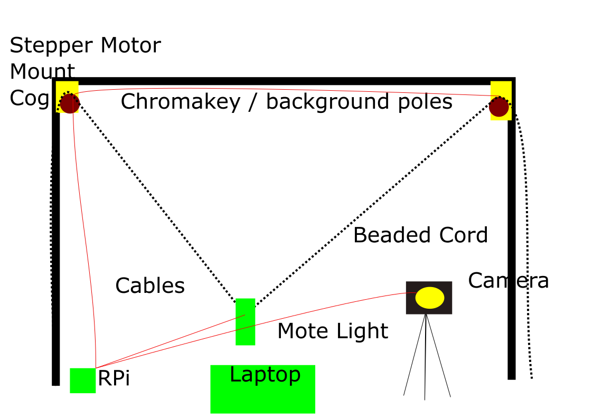
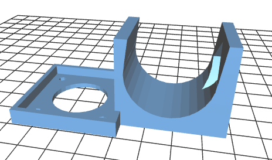

# AssistiveLightPainting

Using SVG drawings to make light paintings using a custom large RGB light based non-orthongal plotter.

## Do you want to make stuff like this ???

## But physically moving a light quickly is difficult for you?

We are building a system to help. It will allow you to animate on your laptop and have a mechansism do the physical moving of the lights.

This uses the following technologies:-
 - Raspberry Pi
 - https://www.adafruit.com/product/2348
 - SVG
 - http://anigen.org/versions/0_8_1/
 - https://shop.pimoroni.com/products/mote
 - Out version of vPiP   https://github.com/EduMake/vPiP

## System Layout

You will prepare the animation and at shooting time set up a frame (we are prototyping with a 2.5m x 4m Chromakey background frame). Attach our vPlotter mounts, beaded cord and lights. 

## Our custon vPlotter Mount

### Currently in Development.

## The Proposed Process

- Install our software and hardware on a raspberry pi
- Use inkscape to draw your characters
- Use inkscape to layout your scenes 
- Use Anigen to animate those scenes http://anigen.org/versions/0_8_1/
  - Line colours and widths should be picked up by the lights on the vplotter
- Export the animation as zip file of indvidual frames
- Set up our custom, large format light v-plotter, using our parts and a frame.
- Set up camera and raspberry pi control box
- Run through setup procedure in software
- Using your laptop you will then trigger each frame to be lightpainted whilst the camera takes the shot
- The images are then compiled into a movie file.
